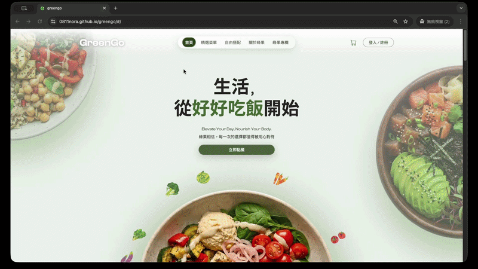
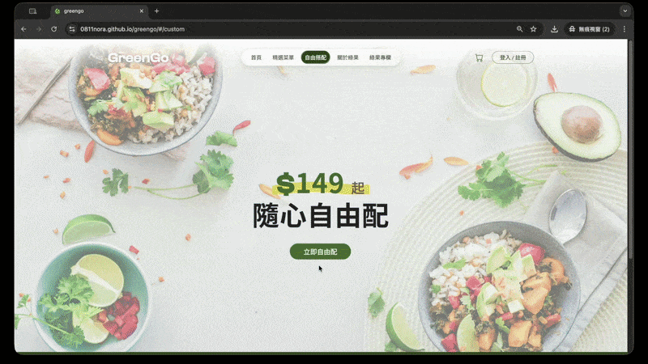
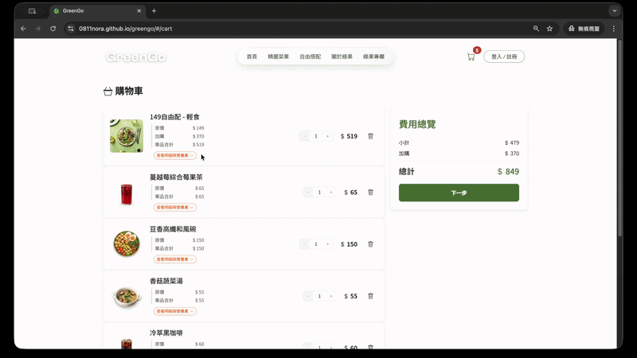
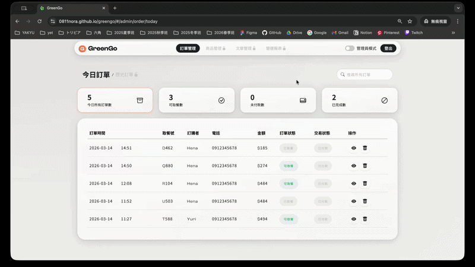

#  GreenGo 綠果

    

> GreenGo 綠果以「透明、直覺、可控的健康飲食」為核心理念，致力於打破傳統的線上點餐框架。
> 我們打造了**客製化選食與即時營養計算系統**，讓主食、蛋白質、配料與醬汁的搭配，都能即時呈現**熱量與三大營養素**比例。
> 希望讓每一位使用者不僅是訂購一份餐盒，更能清楚掌握吃進去的營養組成，輕鬆落實最貼近自身需求的個人化健康飲食。

---

## 目錄

- [線上作品連結](#線上作品連結)
- [功能展示](#功能展示)
- [核心功能](#核心功能)
- [技術棧](#技術棧)
- [本地安裝與啟動](#本地安裝與啟動)
- [環境變數說明](#環境變數說明)
- [資料夾結構](#資料夾結構)
- [團隊分工](#團隊分工)
- [未來規劃](#未來規劃)

---

## 線上作品連結

[](https://0811nora.github.io/greengo/) [](https://0811nora.github.io/greengo/#/admin) [](https://github.com/0811nora/greengo)

> **後台測試帳號**
>
> - 員工登入後即可進入訂單管理
> - 切換「管理員模式」需輸入密碼：`0000`（可解鎖商品管理、文章管理、營運報表）

---

## 功能展示

- 前台｜固定餐點流程
  

- 前台｜客製化餐點流程
  

- 前台｜結帳流程
  

- 後台｜訂單管理 & 管理員模式切換
  

---

## 核心功能

### 前台

| 功能       | 說明                                                                                                           |
| ---------- | -------------------------------------------------------------------------------------------------------------- |
| 固定餐點   | 瀏覽配好的餐點，查看食材、熱量、營養素（蛋白質 / 脂肪 / 碳水），另有提供忌口篩選與排序                         |
| 客製化餐點 | 選擇三種套餐方向（輕食 / 均衡 / 高蛋白），並客製餐點（基底、蛋白質、配菜、醬料），即時顯示總熱量與各營養素數值 |
| 購物車     | 即時同步購物車狀態，可對購物車內容進行數量增減、確認其詳情，另可使用優惠券功能                                 |
| 結帳流程   | 填寫購買人資料、選擇結帳方式，送出訂單並取得取餐號碼，後續可前往會員中心頁確認訂單資訊                         |
| 精選文章   | 瀏覽健康飲食相關文章，並支援分類篩選                                                                           |

### 後台

| 角色   | 功能                                                                           |
| ------ | ------------------------------------------------------------------------------ |
| 員工   | 查看與操作**當日**訂單（訂單狀態、交易狀態管理）                               |
| 管理員 | 含員工所有功能，另可操作**歷史訂單**、**商品管理**、**文章管理**、**營運報表** |

---

## 技術棧

### 核心框架

- React 19
- Vite
- React Router DOM

### 狀態管理

- Redux Toolkit
- React Redux

### UI / 樣式

- Bootstrap 5 + Bootstrap Icons + React Bootstrap
- SCSS
- Animate.css 4.1

### 動畫

- Swiper
- AOS（Animate On Scroll）
- [matter.js](https://brm.io/matter-js/)（物理引擎，用於特效頁面）
- Framer Motion

### 表單

- React Select（忌口篩選）
- React Hook Form
- React Quill New（後台文章編輯器）

### 圖表

- [ApexCharts](https://apexcharts.com/) + [React ApexCharts](https://apexcharts.com/docs/react-charts/)（營養素計算）
- Recharts（後台營運報表）

### 資料處理 / 工具

- Axios
- React Toastify
- [Lodash](https://lodash.com/)
- [React Infinite Scroll Component](https://github.com/ankeetmaini/react-infinite-scroll-component)
- [react-use](https://github.com/streamich/react-use)
- Day.js

---

## 本地安裝與啟動

> 建議使用 Node.js v20.19 以上（或 v22+）

```bash
# 1. Clone 專案
git clone https://github.com/0811nora/greengo.git

# 2.移動到專案內
cd greengo

# 3. 安裝套件
npm install

# 4. 運行專案
npm run dev

# 5. 開啟專案
# 在瀏覽器網址列輸入以下即可看到畫面
# 前台
http://localhost:5173/
# 後台
http://localhost:5173/#/admin
```

## 環境變數說明

專案根目錄有 `.env` 設定檔，請確認環境變數已正確設置（如 API Base URL 等）。

## 資料夾結構

```
greengo/
├── public/
├── docs/demo/
└── src/
    ├── api/
    ├── assets/
    │   ├── fonts/
    │   ├── image/
    │   └── style/
    ├── components/
    ├── config/
    ├── data/
    ├── hooks/
    ├── layout/
    ├── pages/
    │   ├── （前台頁面）
    │   └── admin/        # 後台頁面
    ├── routes/           # 路由設定（index 為入口）
    ├── store/            # Redux Store
    ├── utils/
    ├── App.jsx
    └── main.jsx
```

---

## 團隊分工

| 成員                                      | 共用 / 架構                                          | 前台                                                 | 後台                                                                      |
| ----------------------------------------- | ---------------------------------------------------- | ---------------------------------------------------- | ------------------------------------------------------------------------- |
| [**Nora**](https://github.com/0811nora)   | 專案規劃、架構建立、API 整合、Router 設定            | 客製化餐點頁（即時熱量計算）、文章總覽頁             | 文章管理（新增 / 修改 / 刪除 / 篩選、富文字編輯器）                       |
| [**Emma**](https://github.com/soemmaooo)  | 前後台視覺設計、結帳相關 API                         | 購物車、送出訂單、結帳頁、會員中心頁                 | 商品管理（新增 / 修改 / 刪除 / 篩選）                                     |
| [**Mini**](https://github.com/Miiinii32)  | 前後台視覺設計、固定餐點與訂單 API、後台角色流程規劃 | 固定餐點頁（忌口篩選 / 排序）                        | Header、訂單管理（今日 / 歷史）、管理者登入模式（區分角色的後台使用途徑） |
| [**芋頭**](https://github.com/chichi0127) | 登入與登出驗證、OG MetaData / SEO                    | 關於綠果頁、FAQ 頁（matter.js 動畫）                 | 後台登入、登出驗證與狀態邏輯                                              |
| [**Angel**](https://github.com/chia-zz)   | 專案開發排程規劃、處理全域 SCSS 變數設定             | 首頁、Header / Footer、登入 / 註冊 Modal、單篇文章頁 | 營運報表頁（時間篩選）                                                    |

## 未來規劃

- 串接 Firebase，建立會員資料庫功能
- 優化後台訂單搜尋欄，提升查詢體驗
- 加入更多客製化選項與個人化推薦功能

## 注意事項

本專案為練習作品，請注意下列事項：

- 結帳流程**請勿填入個人真實資料**（姓名、電話、帳號密碼等）
- 本網站**不會儲存任何個人資料**，但表單資料仍會經由 API 傳送至第三方練習伺服器，故**請勿填入真實個資**
- 本專案使用六角學院提供的練習用 API，僅供學習與展示使用
